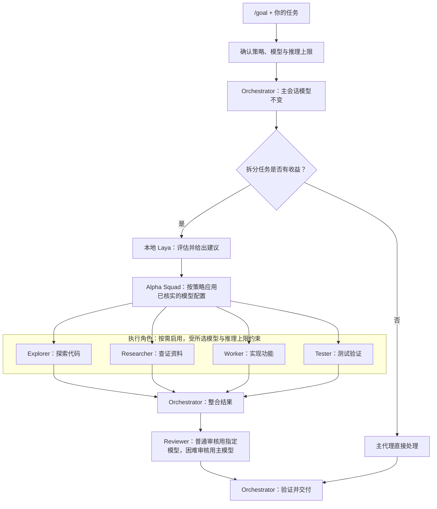

# Oh My Laya

[English](README.md) | [简体中文](README-ZH.md)

> 一条命令，把本地 Laya 决策能力接入你的编码 Agent。

Oh My Laya 基于 [laya-mlx](https://github.com/mizorewww/laya-mlx)，自动下载并校验 Hugging Face 权重，随后注册 `laya_tell_me` 工具。它适合做分类、评分、风险分流和是非判断；模型下载完成后，推理完全在本机运行。

支持 Codex、Claude Code、DeepSeek Harness（DSH）和 pi-agent。安装器会检测本机已有工具，允许单选、多选或选择全部。

## 一键安装

要求：Apple Silicon、macOS 14+、Python 3.11+。默认多语言 FP16 权重约 678 MB。

一键安装并注册到所有已检测到的客户端：

```bash
sh -c "$(curl -fsSL https://raw.githubusercontent.com/leo1394/oh-my-laya/master/tools/oh-my-laya.sh)"
```

没有 curl 时使用 wget：

```bash
sh -c "$(wget -qO- https://raw.githubusercontent.com/leo1394/oh-my-laya/master/tools/oh-my-laya.sh)"
```

请先安装你要使用的 Agent 客户端，Oh My Laya 会自动接入本机已有的客户端。

已克隆项目？在项目根目录运行交互式安装器：

```bash
./install.sh
```

无需交互：

```bash
./install.sh --targets codex
./install.sh --targets codex,claude
./install.sh --targets all
```

`all` 和 `both` 都表示注册到所有已检测到的客户端。安装完成后，请重启对应 Agent 会话。

安装完成后，启动本地贪吃蛇演示：

```bash
laya --snake
```

安装器自动补齐 demo 依赖并配置已安装的模型，无需手动查找路径。使用 `laya --snake --help` 查看演示选项。如果安装器提示命令目录不在 PATH，按其提示配置一次即可。

安装时会为每个选中的客户端分别询问 **Use Alpha Squad + Laya with /goal? [y/N]**。
选择 `y`，将 Goal workflow 写入该客户端的全局指令文件，自动使用真实的 Skill 安装路径；
已有同名小节会先备份再替换，其他内容保持不变。选择 `n` 则不修改全局规则。

无人值守安装可显式选择：

```bash
./install.sh --targets all --goal-workflow yes
# 或保持全局规则不变：
./install.sh --targets all --goal-workflow no
```

| 客户端 | 默认全局指令文件 |
| --- | --- |
| Codex | `~/.codex/AGENTS.md` |
| Claude Code | `~/.claude/CLAUDE.md` |
| DSH | `~/.dsh/AGENTS.md` |
| pi-agent | `~/.pi/agent/AGENTS.md` |

支持客户端自定义配置目录。启用后，新开会话使用 `/goal` 开始任务。
Codex、Claude Code 和 DSH 保留原生 Goal 实现，所装版本／配置需支持该功能。
pi 安装 `/goal` 提示模板，**不是持久 Goal 循环**；已有冲突模板会保留并报错。
模型选择和子代理调用取决于宿主实际能力，不支持时需用户确认人工回退，不会绕过权限。
没有交互终端时，默认不修改全局规则。

## 开始使用

### 从一个 Goal 开始

安装时已启用 `/goal` 配合？新开 Codex 会话，通过 `/goal` 进入 Goal 模式，
直接把问题交给 Codex：

```text
为这个项目增加搜索功能，补齐测试，并完成代码审查。
```

1. **弹窗确认策略。** 首次配置时，在同一个弹窗中选择 Laya 建议策略、执行模型与推理上限、审核配置，最后点击 **Confirm and continue**。选择全自动建议后，子代理路由无需逐次选择；后续任务会重新校验已保存的设置。
2. **Codex 自动拆分任务。** Alpha Squad 按需协调探索、开发、测试、研究和审核；小任务可以由主代理直接完成。
3. **子代理配置由 Laya 决策辅助。** Laya 评估任务，Alpha Squad 通过宿主将已接受的模型／推理建议应用到子代理。自动执行路由只使用你选定的模型，推理档位不超过所选上限，主会话模型保持不变。
4. **协作完成并验证。** 子代理返回聚焦的结果，由主代理整合、验证并交付。高难度、高风险或不确定的审核使用主会话模型与档位，普通审核使用你配置的审核模型。



图中展示职责分工，并非所有角色固定并行启动；Alpha Squad 按依赖安排工作，
需要询问时仍按你选定的策略等待确认。

**减少 token 浪费：** 轻量路由判断交给本地 Laya，子任务聚焦分工、推理档位按需分配，
减少不必要的大模型工作。实际节省量取决于任务；多代理协调也有开销，因此只在有收益时拆分，
不会为了分工而分工。选择不同模型本身并不保证减少 token 数。

弹窗和模型分配依赖宿主支持；执行权限审批仍然有效，不会因启用此流程而自动授权敏感操作。

### 直接询问 Laya

不需要协作流程时，也可以单独做一次判断：

```text
使用 Laya 将当前改动判断为低、中、高风险，并判断是否需要人工审查。
```

Oh My Laya 提供以下工具：

| 工具 | 用途 |
| --- | --- |
| `laya_tell_me` | `choice` 分类、`score` 评分、`noul` 是非概率 |
| `laya_advisor_preferences` | 查看或修改模型建议偏好 |

Laya 不生成代码，也不应被用于授权删除、发布等高风险操作。多语言模型总上下文为 1,024 tokens，长内容请先让 Agent 摘要。

## Codex 模型建议

每个选中的客户端都会安装建议 Skill，并从 GitHub 获取最新版
[Alpha Squad](https://github.com/leo1394/skill-alpha-squad-coding-craft)。已有的非托管版本或本地修改会被保留。
重启客户端。在 Codex 中可输入：

```text
使用 $laya-model-advisor 为当前会话的每个新任务评估模型与推理档位，先让我选择建议授权策略。
```

支持**每次询问**、**仅高复杂度／高风险／不确定时询问**、**全自动接受建议**。偏好跨会话保存，随时可在对话中修改。询问时会列出已核实的可用模型，允许选择其他模型及其支持的推理档位。未配置模型分档时，默认保持当前模型、仅建议推理档位；仍可手动选择列表中的其他模型。

这是建议版：接受建议**不等于切换当前模型**，请在 Codex 模型选择器中应用。客户端支持时使用弹窗，否则在对话中询问。会话评估由 Skill 驱动，不是保证每条消息触发的钩子。无法核实模型列表时，会请你提供列表。这些偏好不会绕过执行权限审批。

设置在同一个弹窗内完成：策略 → 模型 → 推理档位 → **Confirm and continue**。全自动模式仍需选择模型与档位：自动建议只使用选定模型，推理不超过所选上限（默认建议 `high`），本地禁用档位不会显示。旧的自动策略没有上限时，需要重新设置。

### 为子代理选择模型

```text
使用 $alpha-squad-coding-craft 配合 $laya-model-advisor，配置 Laya 子代理模型路由。
```

同一个弹窗完成策略、执行模型／档位、审核模型／档位，最后 **Confirm and continue**。
主会话模型保持不变。执行类子代理使用已接受的 Laya 建议；自动模式只使用选定模型，推理不超过上限。
高难度、高风险或不确定的审核使用主会话的原模型与档位，普通审核使用指定的审核配置。
Alpha Squad 通过宿主设置子代理模型，不会切换主会话模型。

没有 Laya 时，Alpha Squad 仍可独立使用，在同一个弹窗中人工选择模型。
重新运行安装器即可获取上游更新；本地自定义内容不会被静默覆盖，网络失败也不会被当作更新成功。

## 常用选项

```bash
# 选择其他权重
./install.sh --targets all --model english
./install.sh --targets dsh --model typed-decisions

# 只预览，不下载、不修改配置
./install.sh --targets codex --dry-run
```

默认安装到 `~/.local/share/oh-my-laya/`。每个 Agent 会启动独立的惰性 MCP 进程；同时调用时，每个进程都会占用一份统一内存。

## 开发验证

```bash
PYTHONPATH=src python3 -m unittest discover -s tests -v
```

项目受 [MIT License](LICENSE) 许可。
