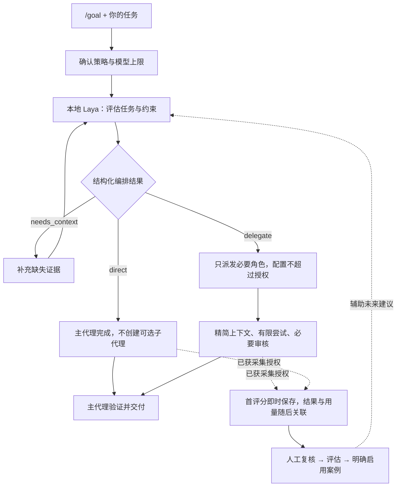
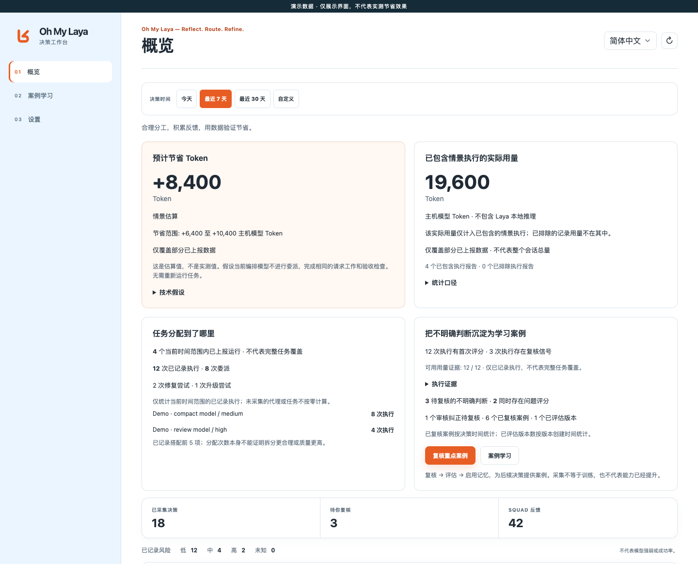

# Oh My Laya
**为你的 AI Agent 提供原生 Laya 决策。** 将 [Laya-MLX](https://github.com/mizorewww/laya-mlx) 接入 Codex、Claude Code、DeepSeek Harness（DSH）和 pi-agent：简单任务直接完成，必要子任务在授权内分配模型，再从经过复核的反馈中积累经验。适用于研究、分析、规划、编码等 Agent 任务，不限于软件开发。

- **Reflect · 判断。** 本地推理直接返回分类、评分和概率，不需要生成文本再解析。
- **Route · 分配。** 配合 [Alpha Squad](https://github.com/leo1394/skill-alpha-squad-coding-craft)，按需选择角色、模型与推理档位，主会话模型保持不变。
- **Refine · 改进。** 保留首次评分，复核不明确的决策；案例经过评估与明确启用后，才能辅助未来建议。


[English](README.md) | [简体中文](README-ZH.md)

## 一键安装

Apple Silicon Mac · macOS 14+ · Python 3.11+。请先安装 Agent 客户端。默认多语言权重约 678 MB，下载后推理在本机运行。

```bash
sh -c "$(curl -fsSL https://raw.githubusercontent.com/leo1394/oh-my-laya/master/tools/oh-my-laya.sh)"
```

<details>
<summary>使用 wget，或从本地仓库安装</summary>

```bash
sh -c "$(wget -qO- https://raw.githubusercontent.com/leo1394/oh-my-laya/master/tools/oh-my-laya.sh)"

# 交互选择客户端
./install.sh

# 指定客户端，或选择所有已检测到的客户端
./install.sh --targets codex
./install.sh --targets codex,claude
./install.sh --targets all
```

`all` 和 `both` 都选择所有已检测到的客户端。安装器自动下载并校验模型，安装预编译工作台，无需 Rust 或 Node.js。

</details>

安装时，在 **Use Alpha Squad + Laya with /goal?** 选择 **y** 即可接入工作流。安装器先备份，再更新客户端全局指令中的 Goal 小节；选择 **n** 则不修改。无人值守安装可添加 `--goal-workflow yes` 或 `--goal-workflow no`。

安装后重启 Agent 会话。Codex 中可在 **Plugins → Personal → Oh My Laya** 找到插件，然后新建任务。Codex 需要支持 `plugin add` 的 CLI。Advisor 与 Squad 作为独立 Skill 安装；已有非托管版本或本地修改会被保留。

## 开始使用

### 从一个 Goal 开始

启用 Goal 集成后，输入 `/goal`，描述你希望完成的结果：

```text
为这个项目增加搜索功能，补齐测试，并完成代码审查。
使用 Alpha Squad 配合 Laya 的结构化编排，先检查兼容性；
保持我的主模型、授权上限和采集设置不变。
```

1. **确认边界。** 选择建议策略、执行模型与推理上限、审核配置，最后提交 **Confirm and continue**。后续任务会重新校验已保存的选择。
2. **先判断，再拆分。** 明确、低风险的局部工作可留给主代理；有价值的独立工作才派发必要角色。信息不足先补证据，不机械增加代理。
3. **在授权内执行。** Squad 通过宿主应用已接受的配置，传递聚焦上下文，并限制修复与升级尝试。必要审核和执行权限审批仍然有效。
4. **保留真实反馈。** 获准采集时，即时保存首次评分，后续测试与审核反馈、实际模型配置和可用用量分别关联，不覆盖原记录。在工作台复核不明确或存在问题的案例。


```mermaid
flowchart TD
    goal["/goal + 你的任务"] --> limits["确认策略与模型上限"]
    limits --> assess["本地 Laya：评估任务与约束"]
    assess --> plan{"结构化编排结果"}
    plan -->|"direct"| direct["主代理完成，不创建可选子代理"]
    plan -->|"needs_context"| clarify["补充缺失证据"]
    clarify --> assess
    plan -->|"delegate"| squad["只派发必要角色，配置不超过授权"]
    squad --> work["精简上下文、有限尝试、必要审核"]
    direct --> verify["主代理验证并交付"]
    work --> verify
    work -.->|"已获采集授权"| feedback["首评分即时保存，结果与用量随后关联"]
    direct -.->|"已获采集授权"| feedback
    feedback --> study["人工复核 → 评估 → 明确启用案例"]
    study -.->|"辅助未来建议"| assess
```

**加载 Squad，不等于必须组建一支队伍。** `direct` 会清空可选派发参数。仅复杂度低不能取消强制审核或其他明确义务。这些规则由宿主遵守，不是拦截所有原生代理调用的硬执行器。

结构化编排需明确启用，并使用兼容的本地工具与配套 Skill。Agent 会检查支持情况；不支持时如实说明回退，不假称已执行新策略。需要关闭时，让 Agent 停止结构化编排，已有反馈仍保留。本地源码安装见[开发](#开发)。

执行角色包括 explorer、researcher、worker、tester，均按需启用。困难、高风险或不确定的审核使用主会话模型与档位，普通审核使用指定的审核配置。自动建议只在选定模型和推理上限内生效，三档映射不会扩大授权。

**目标是减少 Token 浪费，不是承诺固定节省比例。** 避免无必要的委派、重复上下文和无效重试。协作本身也有开销；更便宜的模型不一定使用更少 Token，实际收益取决于任务和完成质量。

宿主能力有差异：Codex、Claude Code、DSH 需要兼容的 Goal 实现／配置；pi 使用 `/goal` 提示模板，不是持久 Goal 循环。弹窗和子代理配置取决于宿主支持，不支持时会明确告知。

### 直接询问 Laya

直接对 Agent 说：

```text
使用 Laya 将当前改动判断为低、中、高风险。
展示结构化结果，不修改任何文件。
```

| 工具 | 用途 |
| --- | --- |
| `laya_tell_me` | 结构化分类、评分、是非概率和模型建议 |
| `laya_advisor_preferences` | 查看或修改建议偏好 |
| `laya_feedback` | 保存已授权的反馈，包括原始首次评分 |

需要会话级建议时，可说：**“使用 `$laya-model-advisor` 评估每个新任务，先让我选择建议策略。”** 支持每次询问、仅高复杂度／高风险／不确定时询问，以及选定模型和推理上限内的自动建议。接受建议不会切换主会话模型，也不授予执行权限。

Laya 不生成代码。多语言模型总上下文为 1,024 tokens，决策输入应简洁，摘要时必须保留相关约束。

体验本地贪吃蛇演示：

```bash
laya --snake
```

安装时已配置依赖与模型路径，更多选项见 `laya --snake --help`。

## 看清决策，改进下一次判断

```bash
laya dashboard
```

工作台地址为 **http://127.0.0.1:18686**。命令会启动服务并配对浏览器。添加 `--port 18687` 可指定其他端口；更换前先用 `laya stop` 停止已运行的服务。



*实际工作台界面，使用合成演示数据；不是产品实测节省率，也不含个人用量。*

- **概览：** 同时查看情景预估节省量、已记录实际用量、模型分配、复核信号和覆盖范围。支持今天、近 7 日、近 30 天、自定义时间。
- **案例学习：** 查看不明确的判断和原始 Squad 反馈，人工调整标签，整理已复核的学习案例。从概览进入时沿用时间范围。
- **设置：** 配置低／中／高三档模型组合、控制采集、管理备份。支持中英文切换。

预估不等于实测节省；缺失用量明确标注，负收益不会隐藏。首次评分与后续纠正分别保留。案例只有经过评估和明确启用才影响后续决策，采集不等于自动训练模型权重。

## 更新与恢复

重新运行安装器即可更新，本地自定义内容不会被静默覆盖。配套 Skill 来自仓库固定版本的子模块。默认安装目录：`~/.local/share/oh-my-laya/`。

数据库升级前会创建私有备份，可在**设置 → 备份与导出**中找到新的迁移快照。恢复会保留隐私删除规则，并备份被替换的状态；不会合并后续新增记录，也不会降级程序。降级二进制前需停服并准备兼容的备份。

## 开发

本地源码安装需要先构建前端与工作台，再将二进制传给安装器；此方式需要 Node.js 和 Rust：

```bash
(cd web && npm ci && npm run build)
cargo build --locked --release -p laya
./install.sh --targets codex --workbench-binary "$PWD/target/release/laya"

# 测试
PYTHONPATH=src python3 -m unittest discover -s tests -v
cargo test --locked -p laya
(cd web && npm test)
```

项目使用 [MIT License](LICENSE)。
