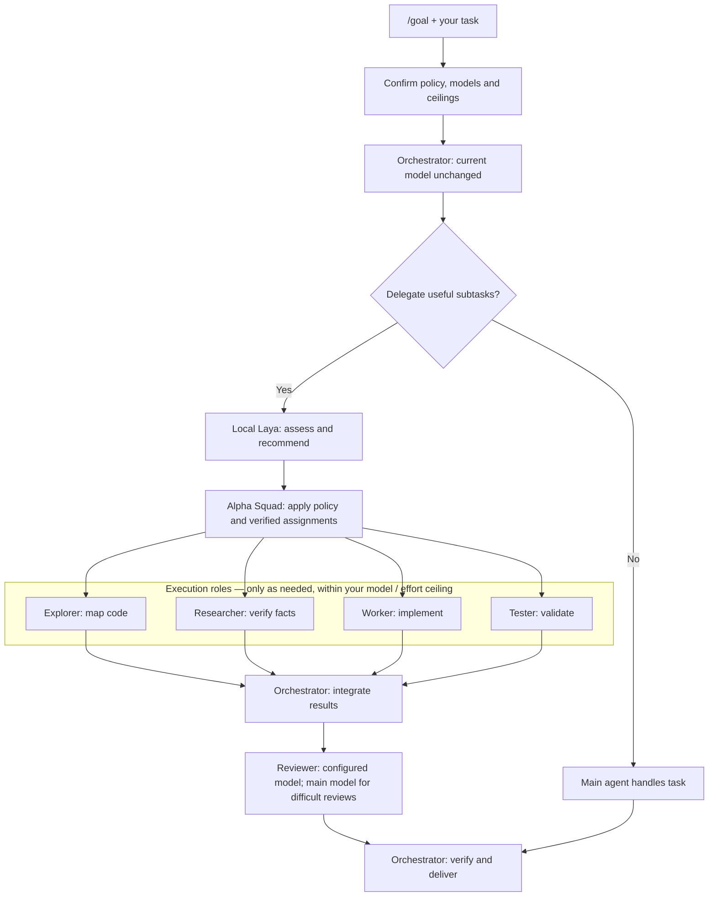

# Oh My Laya

[English](README.md) | [中文](README-ZH.md)

> One command to bring local Laya decision-making to your coding agents.

Oh My Laya builds on [laya-mlx](https://github.com/mizorewww/laya-mlx). It downloads and verifies Hugging Face weights, then registers the `laya_tell_me` tool for classification, scoring, risk routing, and yes/no decisions. Inference runs entirely on your Mac after the model is downloaded.

It supports Codex, Claude Code, DeepSeek Harness (DSH), and pi-agent. The installer detects available clients and lets you select one, several, or all of them.

## Install

Requirements: Apple Silicon, macOS 14+, and Python 3.11+. The default multilingual FP16 checkpoint is approximately 678 MB.

Install and register with all detected clients:

```bash
sh -c "$(curl -fsSL https://raw.githubusercontent.com/leo1394/oh-my-laya/master/tools/oh-my-laya.sh)"
```

Without curl, use wget:

```bash
sh -c "$(wget -qO- https://raw.githubusercontent.com/leo1394/oh-my-laya/master/tools/oh-my-laya.sh)"
```

Install your preferred agent client first; Oh My Laya connects to clients already on your machine.

Already cloned the repository? Run the interactive installer from its root:

```bash
./install.sh
```

For non-interactive installation:

```bash
./install.sh --targets codex
./install.sh --targets codex,claude
./install.sh --targets all
```

Both `all` and `both` register every detected client. Restart the affected agent sessions after installation.

Start the local Snake demo after installation:

```bash
laya --snake
```

Demo dependencies and the installed model are configured automatically. Use `laya --snake --help` for demo options. If the installer reports that the command directory is missing from PATH, follow its displayed PATH instruction once.

For each selected client, the installer asks **Use Alpha Squad + Laya with /goal? [y/N]**.
Choose `y` to add the Goal workflow to that client's global instructions, using actual
installed skill paths. Existing Goal rules are backed up and replaced; other
sections are preserved. Choose `n` to leave global instructions unchanged.

For unattended installation, choose explicitly:

```bash
./install.sh --targets all --goal-workflow yes
# Or leave global instructions unchanged:
./install.sh --targets all --goal-workflow no
```

| Client | Default global instructions |
| --- | --- |
| Codex | `~/.codex/AGENTS.md` |
| Claude Code | `~/.claude/CLAUDE.md` |
| DSH | `~/.dsh/AGENTS.md` |
| pi-agent | `~/.pi/agent/AGENTS.md` |

Custom client home directories are respected. After opting in, start a new session
and use `/goal` for a task. Codex, Claude Code and DSH keep their native Goal
implementation (the installed version/profile must support it). Pi gets a `/goal`
prompt template, **not a persistent Goal loop**; conflicting custom prompts are
preserved and reported. Model selection and delegation require the host's verified
capabilities; unavailable features need an explicit manual fallback. Without an
interactive terminal, global rules are unchanged unless explicitly opted in.

## Use It

### Start with a goal

Enabled `/goal` integration during installation? Open a new Codex session, enter
Goal mode with `/goal`, and give Codex a task:

```text
Add search to this project, cover it with tests, and review the changes.
```

1. **Confirm your strategy.** On first setup, one window collects your Laya policy, execution model and reasoning ceiling, reviewer configuration, and final **Confirm and continue**. Choose automatic recommendations for hands-off subagent routing; saved settings are revalidated on later tasks.
2. **Let Codex split the work.** Alpha Squad coordinates exploration, implementation, testing, research, and review as needed. Small tasks can stay with the main agent.
3. **Let Laya guide subagent assignments.** Laya assesses the work; Alpha Squad applies accepted model/effort recommendations through the host. Automatic execution routing uses only your selected model, at or below your reasoning ceiling. The main session's model stays unchanged.
4. **Complete and review together.** Subagents return focused results to the main agent, which integrates and verifies the work. Difficult, high-risk, or uncertain reviews use the main session's model/effort; ordinary reviews use your configured reviewer.



Roles show responsibilities, not a fixed parallel schedule. Alpha Squad orders
dependent work and requests confirmation when your policy requires it.

**Designed to reduce token waste:** local Laya handles lightweight routing decisions,
while focused subtasks and bounded reasoning help avoid unnecessary large-model
work. Actual token savings depend on the task; subagent coordination adds overhead,
so delegation is used only when useful. Model choice alone does not guarantee fewer tokens.

The confirmation window and model assignments require host support. Execution
approvals still apply; this workflow does not grant permission for sensitive actions.

### Ask Laya directly

For a standalone decision without the squad workflow:

```text
Use Laya to classify the current change as low, medium, or high risk, and decide whether human review is needed.
```

Oh My Laya provides these tools:

| Tool | Purpose |
| --- | --- |
| `laya_tell_me` | `choice` classification, `score` ranking, and `noul` yes/no probability |
| `laya_advisor_preferences` | Read or change model recommendation preferences |

Laya does not generate code and must not authorize destructive, publishing, or other consequential actions. The multilingual model has a total context budget of 1,024 tokens, so ask the agent to summarize long inputs first.

## Codex Model Advisor

Each selected client gets the advisor skill and the latest
[Alpha Squad](https://github.com/leo1394/skill-alpha-squad-coding-craft) from GitHub.
Existing unmanaged or locally modified Alpha Squad installations are preserved.
Restart the client. In Codex, ask:

```text
Use $laya-model-advisor for each new task in this session. Ask me to choose a recommendation policy.
```

Choose **always ask**, **ask only for high complexity, high risk or uncertainty**, or **automatically accept recommendations**. You can change this preference in chat at any time; it persists across sessions. When asking, the advisor lists verified available models and lets you choose a model and its supported reasoning effort. Without a user-defined model tier mapping, it recommends effort changes on the current model; you can still choose another listed model.

This is advisory: accepting a recommendation does **not** switch the active model. Apply it in Codex's model picker. Popups require host support; otherwise the agent asks in chat. Session advice is skill-driven, not a guaranteed per-message hook. If the model list cannot be verified, the advisor asks you to provide it. These preferences never bypass execution approvals.

Setup uses one window: policy → model → reasoning → **Confirm and continue**. In automatic mode, model and effort are still required: advice stays on the selected model and never exceeds the selected effort ceiling (proposed default: `high`). Locally disabled efforts remain hidden. Existing automatic preferences without a ceiling require setup again.

### Route subagent models

```text
Use $alpha-squad-coding-craft with $laya-model-advisor. Configure Laya-based subagent routing.
```

One window configures policy, execution model/effort, reviewer model/effort, and
**Confirm and continue**. The main session stays unchanged. Execution agents use
Laya's accepted recommendations; auto stays within your chosen model and effort
ceiling. Difficult, high-risk or uncertain reviews use the main session's exact
model/effort; ordinary reviews use the configured reviewer. Alpha Squad assigns
subagent models through the host, not through a main-session model switch.

Without Laya, Alpha Squad still works with manual model selection in one window.
Rerun the installer to fetch upstream updates; local customizations are never
silently overwritten. A network failure is reported, not treated as an update.

## Common Options

```bash
# Select another checkpoint
./install.sh --targets all --model english
./install.sh --targets dsh --model typed-decisions

# Preview without downloading or changing configuration
./install.sh --targets codex --dry-run
```

The default installation directory is `~/.local/share/oh-my-laya/`. Each agent starts its own lazy MCP process; concurrent callers each consume a separate unified-memory allocation.

## Development

```bash
PYTHONPATH=src python3 -m unittest discover -s tests -v
```

Licensed under the [MIT License](LICENSE).
