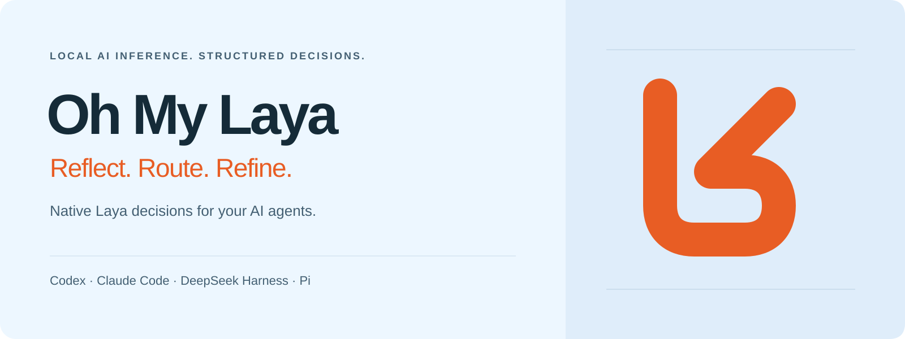
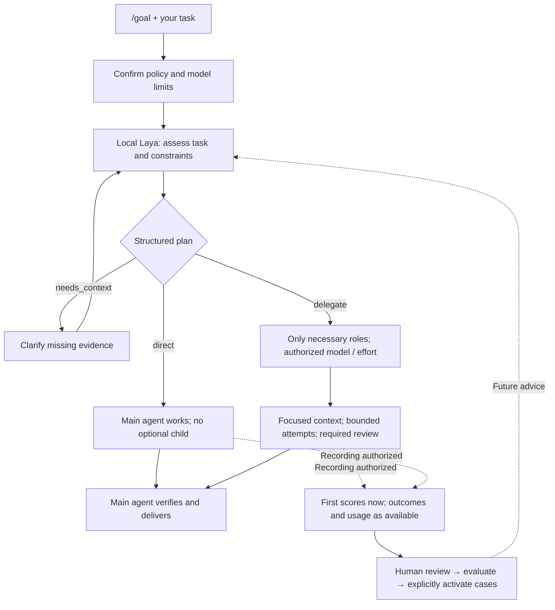
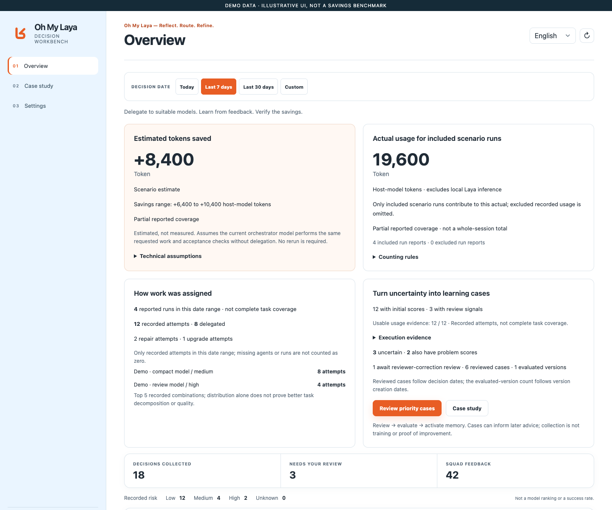

# Oh My Laya
**Native Laya decisions for your AI agents.** Integrate [Laya-MLX](https://github.com/mizorewww/laya-mlx) with Codex, Claude Code, DeepSeek Harness (DSH), and pi-agent: keep simple work with the main agent, route useful subtasks within your model limits, and learn from reviewed feedback. Use it for research, analysis, planning, coding, and other agent tasks.

- **Reflect.** Get structured classifications, scores, and probabilities directly from local inference—not generated text to parse.
- **Route.** Pair with [Alpha Squad](https://github.com/leo1394/skill-alpha-squad-coding-craft) to select necessary roles and model/reasoning combinations. Your main model stays unchanged.
- **Refine.** Preserve first scores, inspect uncertain decisions, and review cases before evaluating and activating them for future advice.

[English](README.md) | [简体中文](README-ZH.md)

## Install

Apple Silicon Mac · macOS 14+ · Python 3.11+. Install your agent client first. The default multilingual weights are approximately 678 MB; inference runs locally after download.

```bash
sh -c "$(curl -fsSL https://raw.githubusercontent.com/leo1394/oh-my-laya/master/tools/oh-my-laya.sh)"
```

<details>
<summary>Use wget, or install from a local checkout</summary>

```bash
sh -c "$(wget -qO- https://raw.githubusercontent.com/leo1394/oh-my-laya/master/tools/oh-my-laya.sh)"

# Interactive client selection
./install.sh

# Choose specific clients, or all detected clients
./install.sh --targets codex
./install.sh --targets codex,claude
./install.sh --targets all
```

`all` and `both` select every detected client. The installer downloads and verifies the model and installs a prebuilt workbench without requiring Rust or Node.js.

</details>

Choose **y** when asked **Use Alpha Squad + Laya with /goal?** to connect the workflow. The installer backs up and updates only the Goal section of your client's global instructions. Choose **n** to leave it unchanged. For unattended setup, add `--goal-workflow yes` or `--goal-workflow no`.

Restart your agent session after installation. In Codex, find **Plugins → Personal → Oh My Laya** and start a new task. Codex needs a CLI with `plugin add` support. The advisor and Squad are installed as separate Skills; existing unmanaged or locally modified Skills are preserved.

## Use It

### Start with a goal

After enabling Goal integration, enter `/goal` and describe the result you want:

```text
Add search to this project, cover it with tests, and review the changes.
Use Alpha Squad with Laya's structured orchestration. Check compatibility first;
keep my main model, authorization ceilings, and recording settings unchanged.
```

1. **Confirm your limits.** Choose a recommendation policy, execution model/reasoning ceiling, and reviewer configuration. Submit **Confirm and continue**; saved choices are revalidated on later tasks.
2. **Decide before dividing.** Clear, low-risk local work can stay with the main agent. Useful independent work gets only the necessary roles. Missing information triggers clarification—not more agents.
3. **Execute within bounds.** Squad applies accepted assignments through the host, using focused context and bounded repair/upgrade attempts. Required review and execution approvals still apply.
4. **Keep the evidence.** With recording authorized, save first scores as they arrive; link later test/reviewer feedback, actual model settings, and available usage without overwriting them. Review uncertain or problematic cases in the workbench.


```mermaid
flowchart TD
    goal["/goal + your task"] --> limits["Confirm policy and model limits"]
    limits --> assess["Local Laya: assess task and constraints"]
    assess --> plan{"Structured plan"}
    plan -->|"direct"| direct["Main agent works; no optional child"]
    plan -->|"needs_context"| clarify["Clarify missing evidence"]
    clarify --> assess
    plan -->|"delegate"| squad["Only necessary roles; authorized model / effort"]
    squad --> work["Focused context; bounded attempts; required review"]
    direct --> verify["Main agent verifies and delivers"]
    work --> verify
    work -.->|"Recording authorized"| feedback["First scores now; outcomes and usage as available"]
    direct -.->|"Recording authorized"| feedback
    feedback --> study["Human review → evaluate → explicitly activate cases"]
    study -.->|"Future advice"| assess
```

**Loading Squad does not mean spawning a squad.** `direct` clears optional spawn parameters. Low complexity alone does not remove a required reviewer or other explicit obligations. These are advisory controls consumed by the host, not a hard interceptor for every native agent call.

Structured orchestration is opt-in and requires compatible installed tools and the companion Skill. The agent checks support and reports fallback rather than claiming the policy ran. To disable it, ask the agent to stop structured orchestration; recorded feedback is retained. For a local build, see [Development](#development).

Execution roles include explorer, researcher, worker, and tester—only when needed. Difficult, high-risk, or uncertain reviews use the main session's model/effort; ordinary reviews use your configured reviewer. Automatic advice stays within the selected model and reasoning ceiling; tier mappings never expand authorization.

**Designed to reduce wasted tokens, not promise a percentage.** Avoid unnecessary delegation, repeated context, and unproductive retries. Coordination itself costs tokens; a cheaper model is not necessarily a lower-token solution. Actual savings depend on the task and quality of the outcome.

Host capabilities vary: Codex, Claude Code, and DSH need a compatible Goal implementation/profile. Pi uses a `/goal` prompt template, not a persistent Goal loop. Popups and subagent assignments require host support; missing capabilities are reported.

### Ask Laya directly

Ask your agent:

```text
Use Laya to classify this change as low, medium, or high risk.
Show the structured result; do not modify any files.
```

| Tool | Purpose |
| --- | --- |
| `laya_tell_me` | Structured classification, scoring, yes/no probability, and model advice |
| `laya_advisor_preferences` | Read or change recommendation preferences |
| `laya_feedback` | Save authorized feedback, including original first scores |

For session-level advice, ask: **“Use `$laya-model-advisor` for each new task; let me choose a recommendation policy.”** Choose always ask, ask for high complexity/risk/uncertainty, or automatic advice within your selected model/effort ceiling. Accepting advice does not switch the main session model or authorize execution.

Laya does not generate code. Keep decision inputs concise: the multilingual checkpoint has a total context budget of 1,024 tokens. Preserve relevant constraints when summarizing.

Try the local Snake demo:

```bash
laya --snake
```

Dependencies and the model path are configured during installation. Use `laya --snake --help` for options.

## See decisions. Improve the next one.

```bash
laya dashboard
```

The workbench runs at **http://127.0.0.1:18686**. The command starts the service and pairs your browser. Use `--port 18687` to choose another port; stop an existing service with `laya stop` before changing it.



*Actual workbench UI with synthetic demonstration data—not measured product savings or personal usage.*

- **Overview:** scenario-estimated token savings alongside recorded actual usage, model assignments, review signals, and coverage. Filter today, 7 days, 30 days, or a custom range.
- **Case study:** inspect uncertain decisions and original Squad feedback, correct labels, and prepare reviewed learning cases. The Overview time range carries over.
- **Settings:** configure low/medium/high model combinations, control recording, and manage backups. English and Chinese are available.

Estimates are not measured savings; incomplete usage stays marked as partial, and negative estimates remain visible. First scores are preserved alongside later corrections. Cases inform future decisions only after evaluation and explicit activation—collection is not automatic weight training.

## Update and recover

Rerun the installer to update; local customizations are not silently overwritten. The companion Skill comes from the repository's pinned submodule. Default installation: `~/.local/share/oh-my-laya/`.

Database upgrades create a private backup. Find new migration snapshots in **Settings → Backup & export**. Restoring recovers that snapshot, honors privacy deletions, and saves the replaced state; it does not merge newer records or downgrade the program. Stop the service and use a compatible backup before a binary rollback.

## Development

To install a local source build, build the frontend and workbench, then pass the binary to the installer. Requires Node.js and Rust locally:

```bash
(cd web && npm ci && npm run build)
cargo build --locked --release -p laya
./install.sh --targets codex --workbench-binary "$PWD/target/release/laya"

# Tests
PYTHONPATH=src python3 -m unittest discover -s tests -v
cargo test --locked -p laya
(cd web && npm test)
```

Licensed under the [MIT License](LICENSE).
